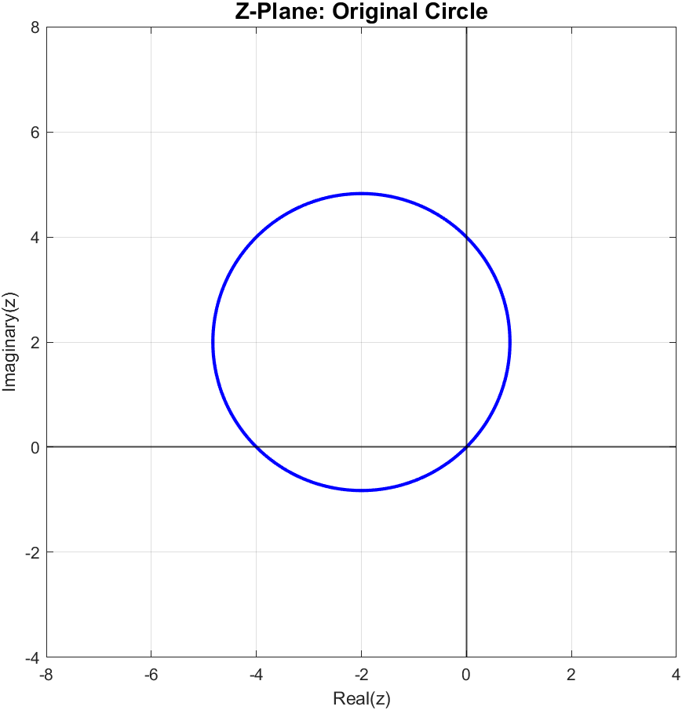
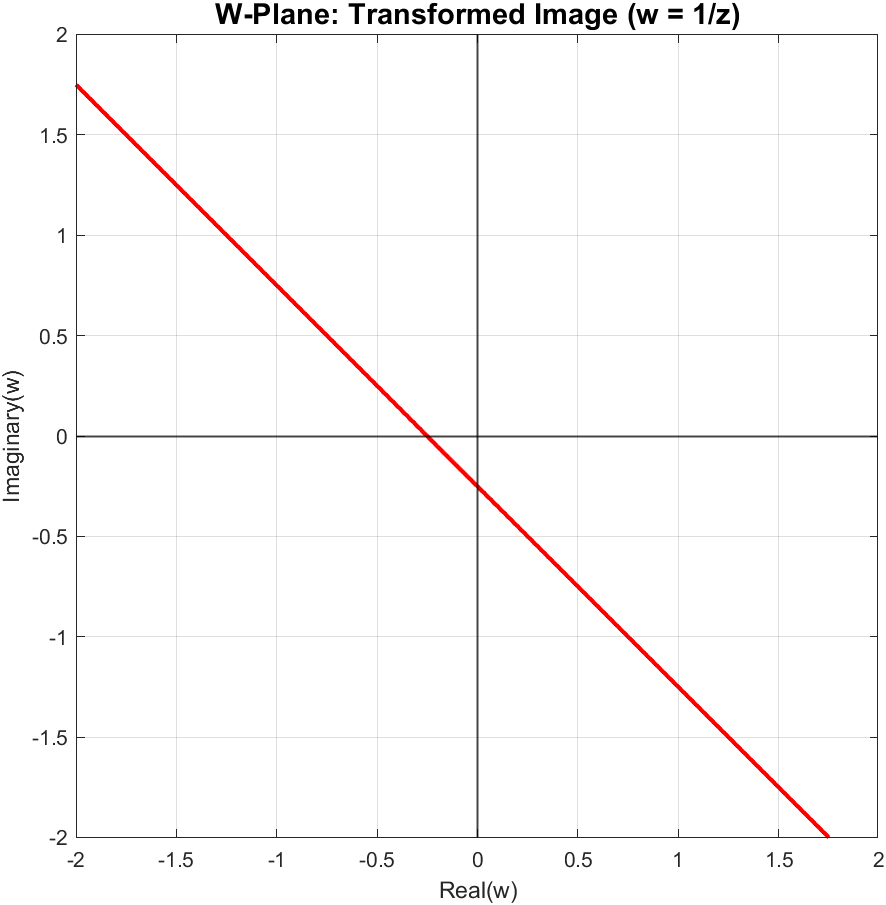

# Complex Inversion Mapping (w = 1/z)

Analytical derivation and MATLAB visualization of geometric transformations in the complex plane using the inversion mapping.

---

## 📌 Project Overview
This project explores conformal mapping in Complex Analysis. Specifically, it investigates how the geometric inversion transformation $w = 1/z$ maps a circle passing through the origin in the $z$-plane into a straight line in the $w$-plane.

Key highlights:
- **Analytical Proof:** Step-by-step derivation demonstrating that the circle $(x+2)^2 + (y-2)^2 = 8$ translates to the linear equation $1 + 4u + 4v = 0$ in the $w$-plane.
- **Computational Geometry:** Use of MATLAB's `meshgrid` and `contour` functions to correctly evaluate and plot loci in both complex domains without point-by-point distortion.

---

## 📂 Deliverables
- **MATLAB Script:** [`complex_mapping_inversion.m`](./complex_mapping_inversion.m)
- **Technical LaTeX Report:** [`complex_mapping_report.pdf`](./complex_mapping_report.pdf)

---

## 📊 Result & Visualizations

| Z-Plane (Original Circle) | W-Plane (Transformed Line) |
|---|---|
|  |  |

> **Observation:** The circle in the $z$-plane passes exactly through the origin $(0,0)$. As predicted by complex analysis theory, the inversion mapping $w = 1/z$ transforms any circle passing through the origin into a straight line not passing through the origin in the $w$-plane.

---

## 🛠️ Built With
- **Language:** MATLAB R2022b
- **Documentation:** LaTeX (`fancyhdr`, `amsmath`, `listings`)
