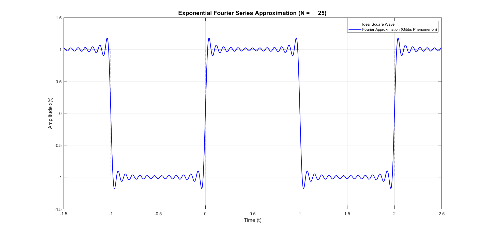

# Exponential Fourier Series Analysis & Gibbs Phenomenon

Mathematical derivation, MATLAB implementation, and numerical visualization of the Exponential Fourier Series for a continuous-time square wave signal.

---

## 📌 Project Overview
This project explores the frequency-domain reconstruction of a periodic square wave $x(t)$ with a fundamental period $T = 2$. By evaluating the complex Fourier coefficients $c_n$ for harmonics $-25 \le n \le 25$, the continuous signal is synthesized to illustrate convergence properties and the **Gibbs Phenomenon** near step discontinuities.

Key highlights:
- Derivation of complex Fourier coefficients $c_n = \frac{1 - (-1)^n}{j n \pi}$ for $n \neq 0$.
- Verification of a zero DC component ($c_0 = 0$) due to signal symmetry.
- Observation of the ~9% overshoot (Gibbs phenomenon) at sharp transition edges.

---

## 📂 Deliverables
- **MATLAB Code:** [`fourier_series_square_wave.m`](./fourier_series_square_wave.m)
- **Technical LaTeX Report:** [`fourier_series_report.pdf`](./fourier_series_report.pdf)

---

## 📊 Result & Visualization

> **Observation:** The plot demonstrates the synthesized square wave against the ideal reference signal. The high-frequency ripples near $t = \dots, -1, 0, 1, \dots$ highlight the limitation of finite Fourier series approximations at step discontinuities.

---

## 🛠️ Built With
- **Language:** MATLAB R2022b
- **Documentation:** LaTeX (`fancyhdr`, `amsmath`, `listings`)
