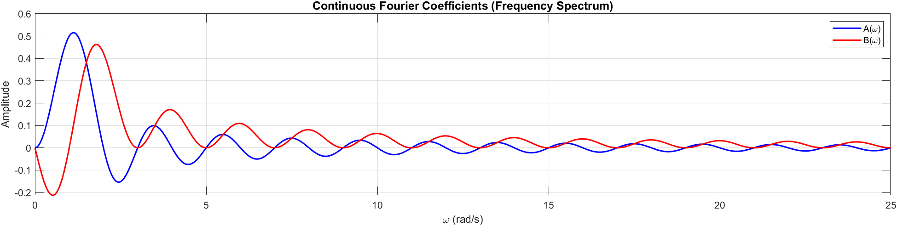
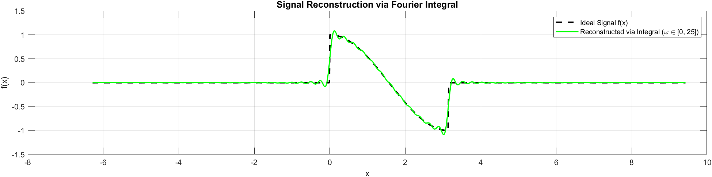

# Fourier Integral Representation & Signal Reconstruction

Mathematical derivation, MATLAB implementation, and continuous frequency spectrum analysis for non-periodic signals using the Fourier Integral.

---

## 📌 Project Overview
This project focuses on representing non-periodic signals defined over continuous domains using the Fourier Integral. Specifically, a truncated cosine pulse $f(x) = \cos(x)$ for $0 < x < \pi$ (and $0$ elsewhere) is evaluated to derive its continuous spectral functions $A(\omega)$ and $B(\omega)$.

Key highlights:
- Theoretical evaluation of continuous spectral coefficient functions $A(\omega) = -\frac{\omega \sin(\omega \pi)}{\pi(\omega^2 - 1)}$ and $B(\omega) = \frac{\omega \cos(\omega \pi) + 1}{\pi(\omega^2 - 1)}$.
- Handling of point singularities at $\omega = 1$ during numerical evaluation.
- Signal reconstruction by evaluating the inverse Fourier integral over $\omega \in [0, 25]$.

---

## 📂 Deliverables
- **MATLAB Script:** [`fourier_integral_solver.m`](./fourier_integral_solver.m)
- **Technical LaTeX Report:** [`fourier_integral_report.pdf`](./fourier_integral_report.pdf)

---

## 📊 Result & Visualizations

| Continuous Frequency Spectrum | Signal Reconstruction |
|---|---|
|  |  |

> **Observation:** The continuous spectrum plot illustrates $A(\omega)$ and $B(\omega)$ over $\omega \in [0, 25]$. The reconstructed signal demonstrates physical convergence to the truncated cosine wave, accurately resolving the discontinuities at $x = 0$ and $x = \pi$.

---

## 🛠️ Built With
- **Language:** MATLAB R2022b
- **Documentation:** LaTeX (`fancyhdr`, `amsmath`, `listings`)
