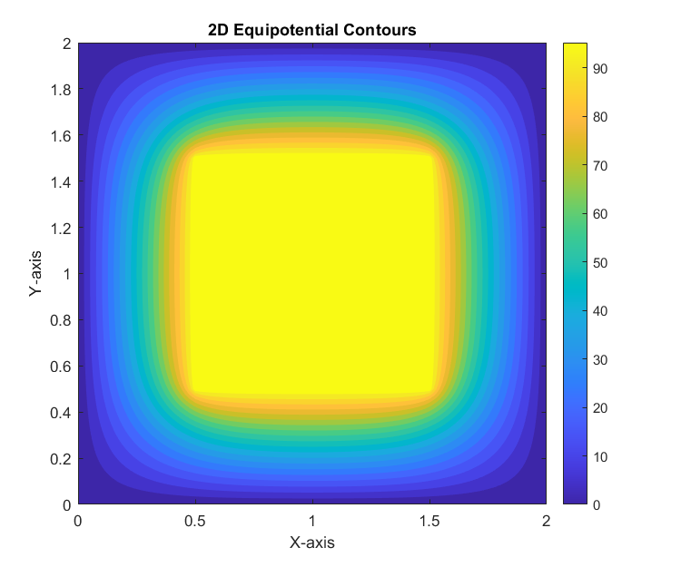
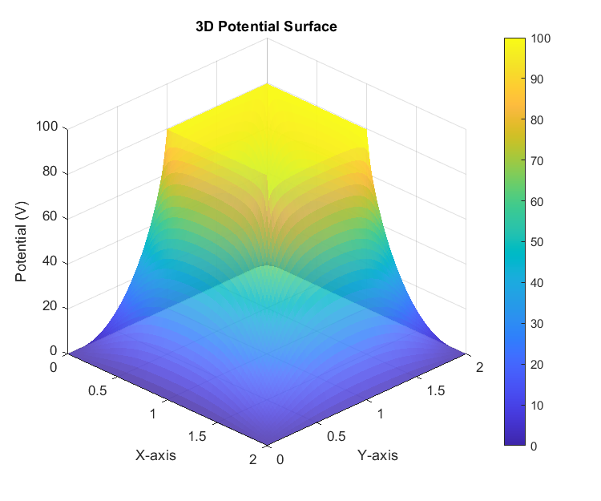

# 2D Laplace's Equation Solver

Numerical solution and finite-difference implementation of Laplace's equation to determine electric potential distribution in a rectangular coaxial cable.

---

## 📌 Project Overview
This project models the spatial potential distribution $V(x,y)$ within a 2D rectangular domain containing an inner rectangular conductor maintained at a fixed potential ($V_0 = 100\text{ V}$) and an outer grounded boundary ($V = 0$). 

Key highlights:
- Discretization of the 2D partial differential equation $\nabla^2 V = 0$ using central finite-difference approximation.
- Implementation of the **Jacobi Iteration Method** with vectorized grid updates for high computational efficiency.
- Dynamic enforcement of Dirichlet boundary conditions at each iteration step.
- Visualization of converged equipotential lines and 3D potential surfaces.

---

## 📂 Deliverables
- **MATLAB Script:** [`laplace_solver.m`](./laplace_solver.m)
- **Technical LaTeX Report:** [`laplace_report.pdf`](./laplace_report.pdf)

---

## 📊 Result & Visualizations

| 2D Equipotential Contours | 3D Potential Surface |
|---|---|
|  |  |

> **Observation:** The contour plot illustrates the smooth gradient of potential from $100\text{ V}$ at the inner conductor down to $0\text{ V}$ at the outer boundary, demonstrating physical convergence after 1000 iterations.

---

## 🛠️ Built With
- **Language:** MATLAB R2022b
- **Documentation:** LaTeX (`fancyhdr`, `amsmath`, `listings`)
