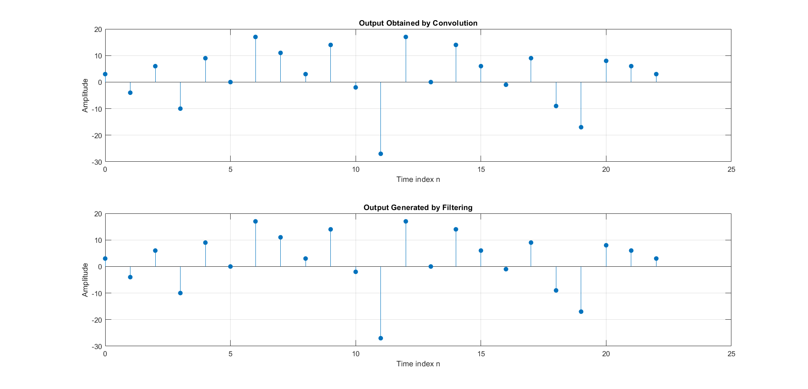
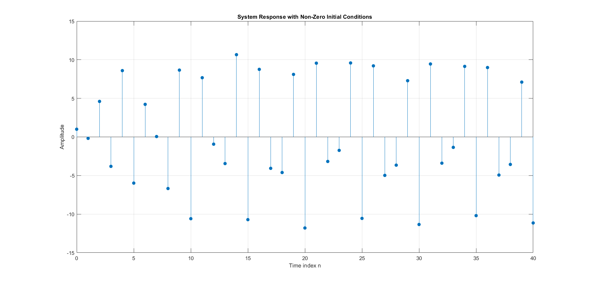
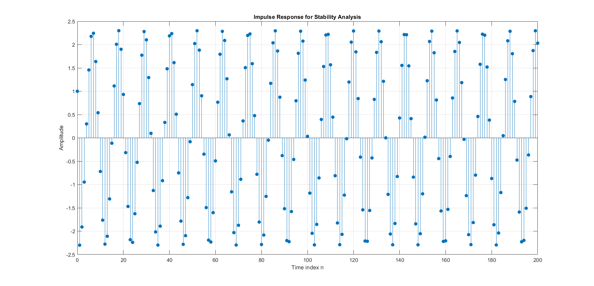

# Discrete-Time LTI Systems & Signal Processing Analysis

Computational modeling and mathematical verification of fundamental Digital Signal Processing (DSP) concepts using MATLAB.

---

## 📌 Project Overview
This project explores the core properties of discrete-time systems, focusing on Linearity, Time-Invariance (LTI), and system stability. By leveraging MATLAB, theoretical DSP concepts are modeled and visualized to analyze how digital filters and systems respond to various input sequences.

Key highlights:
- **System Properties:** Verification of superposition and time-invariance, demonstrating how non-zero initial conditions violate linear behavior.
- **Impulse & Step Responses:** Generation of system responses natively (`impz`) and via direct sequence filtering (`filter`).
- **Convolution vs. Filtering:** Mathematical and computational proof that zero-padded filtering replicates standard discrete-time linear convolution.
- **BIBO Stability:** Algorithmic evaluation of Bounded-Input Bounded-Output stability by testing the absolute summability of the impulse response, successfully identifying an unstable system with poles outside the unit circle.

---

## 📂 Deliverables
- **MATLAB Script:** [`lti_system_analysis.m`](./lti_system_analysis.m)
- **Technical LaTeX Report:** [`lti_system_report.pdf`](./lti_system_report.pdf)

---

## 📊 Visualizations

| Convolution vs. Filtering | Non-Zero Initial Condition | BIBO Stability Check |
|---|---|---|
|  |  |  |

> **Observation:** The plots confirm theoretical DSP principles: zero-padded filtering perfectly aligns with linear convolution, while the stability check visually demonstrates an unstable impulse response diverging over time.

---

## 🛠️ Built With
- **Language:** MATLAB R2022b
- **Documentation:** LaTeX
