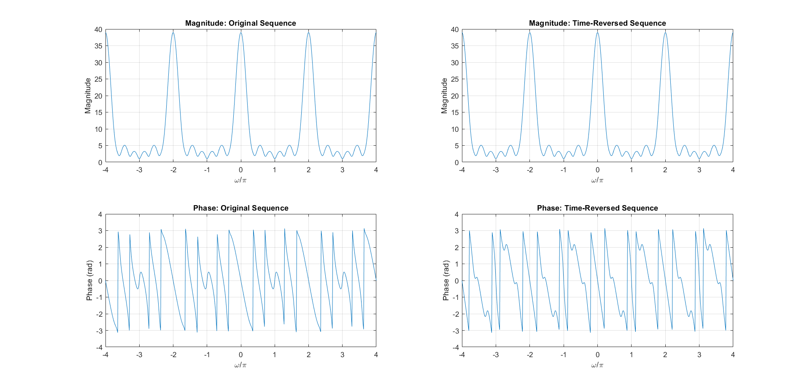
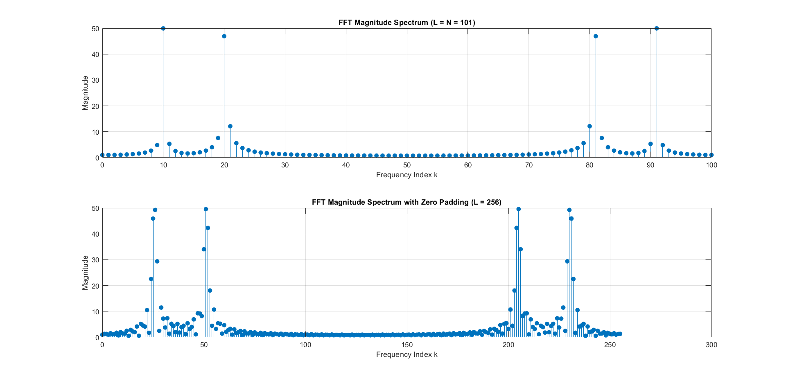

# Fourier Analysis & Convolution Properties

Computational verification of DTFT properties, FFT resolution, and convolution theorems using MATLAB.

## 📌 Project Overview
This project explores the frequency-domain analysis of discrete-time signals. It provides mathematical and computational proofs for the properties of the Discrete-Time Fourier Transform (DTFT) and investigates the practical implementation of the Fast Fourier Transform (FFT).

Key highlights:
- **DTFT Properties:** Visualized the effects of time-shifting, frequency-shifting, and time-reversal on magnitude and phase spectra.
- **FFT Zero-Padding:** Analyzed how appending zeros ($L > N$) increases spectral resolution without altering the underlying time-domain signal.
- **Convolution Theorem:** Demonstrated the mathematical equivalence of direct linear convolution and zero-padded circular convolution in the frequency domain (using FFT/IFFT).

## 📂 Deliverables
- **MATLAB Script:** [`DTFT_Analysis.m`](./DTFT_Analysis.m)
- **Technical LaTeX Report:** [`DTFT_Report.pdf`](./DTFT_Report.pdf)

## 📊 Visualizations

| Time Reversal Property | FFT Zero-Padding Effect |
|---|---|
|  |  |

> **Observation:** The time-reversal plot proves that flipping a sequence leaves the magnitude spectrum unchanged while inverting the phase. The zero-padding simulation demonstrates enhanced frequency resolution without altering time-domain data.
