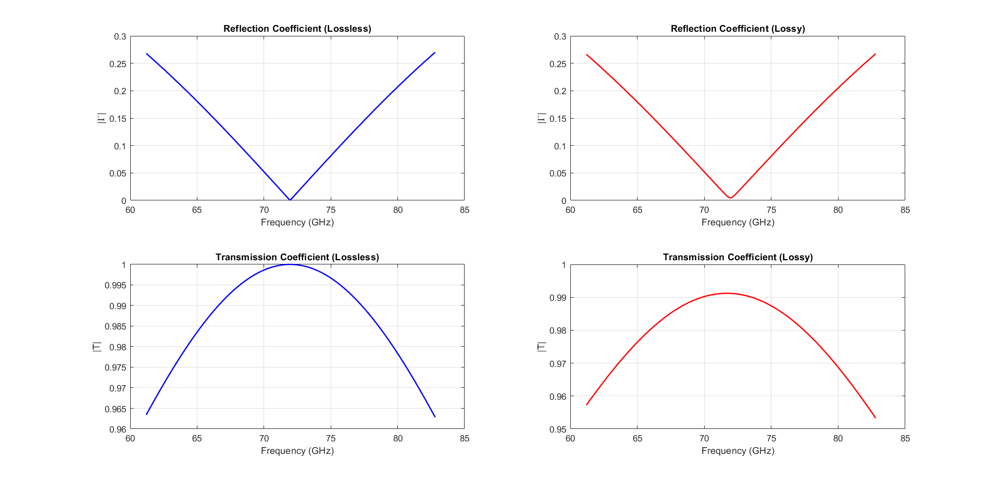
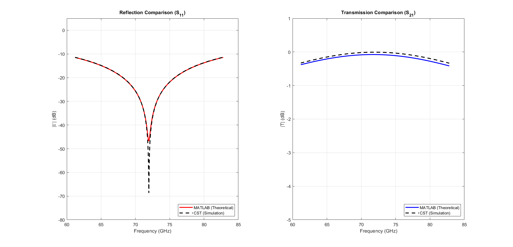
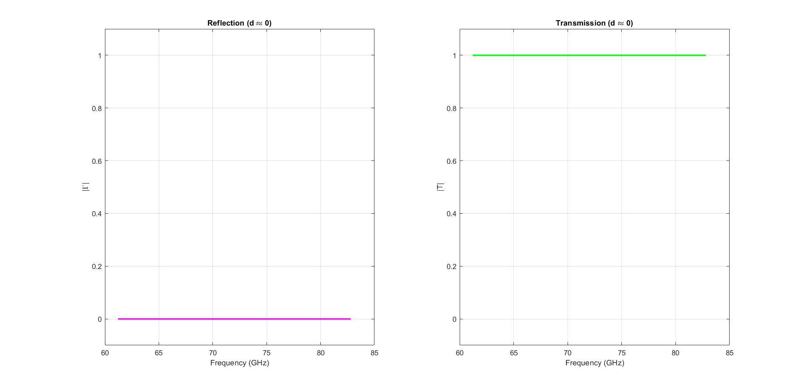

# Half-Wavelength Dielectric Impedance Transformer

Analytical modeling and 3D full-wave electromagnetic simulation of a dielectric slab acting as a half-wave impedance transformer at 72 GHz.

---

## 📌 Project Overview
This project investigates the wave propagation characteristics (Reflection and Transmission) of an electromagnetic wave incident on a dielectric slab ($\epsilon_r = 3.2$). By mathematically sizing the slab to exactly $\lambda/2$ ($1.16\text{ mm}$), the structure is designed to minimize reflection and maximize transmission at the $72\text{ GHz}$ operating frequency.

Key analytical phases:
- **Mathematical Derivation:** Calculation of complex propagation constants ($\gamma$) and intrinsic impedances ($\eta$) for lossless and lossy ($\tan \delta = 0.0048$) dielectric materials.
- **Full-Wave Validation:** Setup of Floquet unit-cell boundaries in **CST Studio Suite** to simulate an infinite planar array, extracting $S_{11}$ and $S_{21}$ parameters.
- **Limiting Case Analysis:** Evaluation of an electrically thin slab ($d \approx 0$) demonstrating frequency-independent surface impedance behavior.

---

## 📂 Deliverables
- **MATLAB Code:** [`impedance_transformer_analysis.m`](./src/impedance_transformer_analysis.m) - Computes coefficients and plots error comparisons.
- **CST Simulation Data:** [`cst_simulation`](./cst_simulation/) - 3D model files and exported S-parameter text files.
- **Technical Report:** [`transformer_report.pdf`](./docs/transformer_report.pdf) - Formal LaTeX documentation detailing equations and boundary conditions.

---

## 📊 Visualizations

| Theoretical Coefficients | Analytical vs. CST Simulation | Thin Slab Limit |
|:---:|:---:|:---:|
|  |  |  |

> **Observation:** The analytical MATLAB model and the 3D full-wave CST simulation demonstrate near-perfect correlation, successfully validating the half-wavelength matching condition at the 72 GHz resonance frequency.

---

## 🛠️ Built With
- **Computational Engine:** MATLAB R2022b
- **Electromagnetic Solver:** CST Studio Suite (Frequency Domain Solver / Floquet Ports)
- **Documentation:** LaTeX
